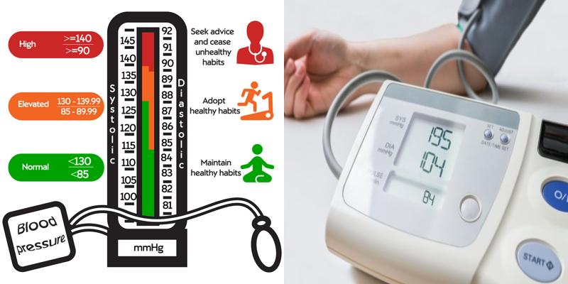

# Blood Pressure Estimator

Blood Pressure Estimator is a machine learning model that accurately estimates cuffless blood pressure.

# Table of Contents

- [Blood Pressure Estimator](#blood-pressure-estimator)
- [Table of Contents](#table-of-contents)
- [Brief Overview](#brief-overview)
- [Presentation](#presentation)
- [Tech-Stacks-Used](#tech-stacks-used)
- [Model](#model)
- [Results](#results)
# Brief Overview
[(Back to top)](#table-of-contents)

This project aimed to develop a machine learning model for accurate cuffless blood pressure assessment, comparing it with the standard Physics-Informed Neural Network (PINN) model. We utilized LSTM for capturing the temporal dependence of blood pressure and CNN to extract key features for effective model training.
# Presentation
[(Back to top)](#table-of-contents)

In order to view the presentation for the above project please visit:- https://github.com/kovidjuneja/BP_Estimator/blob/main/Presentation1.pptx
# Tech-Stacks-Used
[(Back to top)](#table-of-contents)

    1)tensorflow
    2)keras
    3)pandas
    4)matplotlib
    5)numpy
# Model 
[(Back to top)](#table-of-contents)

The model comprises three phases. The first phase includes three convolutional layers with 32, 64, and 128 filters, each with a stride of 3. The second phase features two LSTM layers, each with 64 units. The third phase consists of a dense layer with 60 neurons.
# Results
[(Back to top)](#table-of-contents)

The model achieved a correlation coefficient of 0.89 and a Root Mean Square Error of 8.9, while the standard PINN model had a correlation coefficient of 0.95 and a Root Mean Square Error of 5.3.

You can access the results here:-[https://github.com/kovidjuneja/BP_Estimator/blob/main/Result](https://github.com/kovidjuneja/BP_Estimator/blob/main/Result)

# Report
[(Back to top)](#table-of-contents)

It effectively compares the two models.In order to view it please visit:-https://github.com/kovidjuneja/BP_Estimator/blob/main/reportda221.docx
